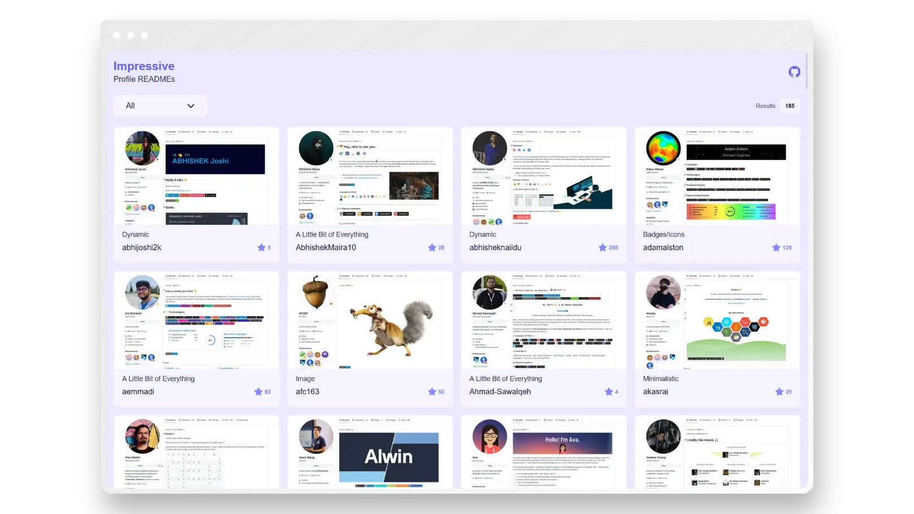

# Impressive Profile READMEs

Get inspired to make your GitHub Profile stand out! Check out our gallery of Impressive Profile READMEs and take your profile to the next level. Our repository, inspired by the [Awesome GitHub Profile README](https://github.com/abhisheknaiidu/awesome-github-profile-readme) and [Creative Profile Readme](https://github.com/coderjojo/creative-profile-readme) GitHub repository, aims to improve upon it by providing faster maintenance, more modern design, and enhanced representation.

<a href="https://roypriyanshu02.github.io/impressive-profile-readmes/" align="center">
  <picture>
    <source media="(prefers-color-scheme: dark)" srcset="./site/static/screenshot-dark.webp">
    
  </picture>
</a>

Remember to give a  if you found this helpful.
